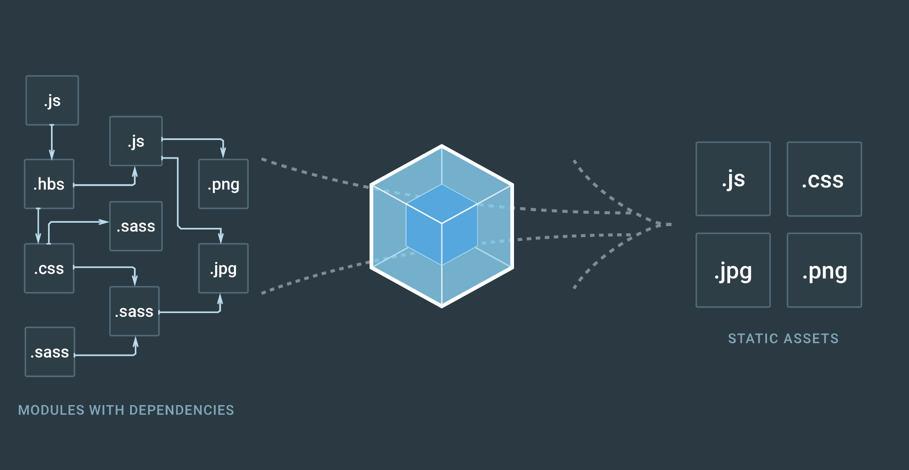
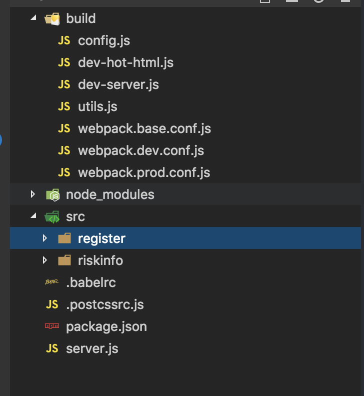

# 使用方法（完成多页面打包）
**1.会抽离所有页面的公共模块到vendor、manifest**<br />
**2.配置只需要在build/config.js下的multiPage下配置即可**<br />
**3.具体思路待后续博客更新**

最近需要自己搭建一套配置来写html，之前只是简单的看过webpack配置，所以就开始动手自己搭建一套webpack2的配置，目前完成了js、css的热加载，（多页面暂时还没有，配置会继续更新）



[webpack2中文文档](https://doc.webpack-china.org/) **如果没有了解过webpack可以先看一下基础文档**

### 先看一眼文件目录,build下是配置文件，src下是源码目录

### 需要一个配置来定义打包的入口和出口
__webpack.base.conf.js__
> 官方是写的webpack.config.js,但是我们可以通过--config 指定配置文件，这里是为了后续分离出开发环境配置，所以定义一个基础配置文件

**代码如下**

```javascript
const webpack = require('webpack')
const path = require('path')
//首先定义工作目录的上下文context和打包输出的目录
//path是处理路径的模块
const DIST_DIR = path.join(__dirname, '../dist')
const CLIENT_DIR = path.join(__dirname, '../src')

module.exports = {
  context: CONTEXT_DIR,
  entry: ['./src/index.js'],
  output: {
    path: DIST_DIR,
    filename: '[name].[hash].js',
    publicPath: '/'
  }
}
```
<font color="#666">
output的filename<br />
[name]:默认是main,如果你的entry是这样的<br />
</font>

```javascript
entry: {
  app: './src/index.js'
}
```
> 那么[name]就是app,[hash]是文件唯一的id值:具体更多说明可以看官方文档<br/>
上面代码就定义了入口文件和出口文件，但是我们的js，css或者scss、less、stylus等预编译语言需要解析，那么就需要配置对应的loader，就是去解析不同类型的文件

- 添加module解析文件
```javascript
module.exports = {
  ...
  module: [
    rules: [{
      test: /\.html$/,
      exclude: /node_modules/,
      use: 'html-loader'
    },
    {
      test: /\.js$/,
      exclude: /node_modules/,
      include: [resolve('src')],
      use: 'babel-loader'
    },
    {
      test: /\.(png|jpe?g|gif|svg)(\?.*)?$/,
      loader: 'url-loader',
      query: {
        limit: 10000,
        name: utils.assetsPath('img/[name].[hash:7].[ext]')
      }
    },
    {
      test: /\.(woff2?|eot|ttf|otf)(\?.*)?$/,
      loader: 'url-loader',
      query: {
        limit: 10000,
        name: utils.assetsPath('fonts/[name].[hash:7].[ext]')
      }
    }
    ]
  ]
}
```
- rules是定义规则
> test是正则
exclude是代表排除在外的文件夹
use是定义我们用什么来插件来解析这个文件
resolve是一个函数
```javascript
function resolve(dir) {
    return path.join(__dirname, '..', dir)
}
```
- utils是一个单独的文件
> 所以需要引入这个文件，这里暂时不讨论这个工具类，作用就是输出到文件夹的作用

- 当我们在代码中require或者import的时候
> 常常我们引入的文件都可以省略掉后缀，我们需要告诉webpack怎么去匹配这些名字，所以加入以下代码

__webpack.base.conf.js__
```
module.exports = {
  ...
  resolve: {
    extensions: [' ', '.js', '.json'],
    alias: {
      src: path.resolve(__dirname, '../src')
    }
  }
}
```
> extensions: 首选的扩展名，注意第一个是为空格空字符串
alias: 定义别名，在代码里import或者require的时候可以写绝对路径，webpack会帮你指向对应的文件夹

- 生成的文件都是自动带有hash值的文件，我们希望webpack能把打包的js和css自动注入到html文件中
- 需要用一个插件html-webpack-plugin,添加代码

__webpack.base.conf.js__
```javascript
...
const HtmlWebpackPlugin = require('html-webpack-plugin')

module.exports = {
  ...
  plugins: [
    new HtmlWebpackPlugin({
      filename: 'index.html',
      template: '../src/index.html'
    })
  ]
}
```
> filename: 定义输出的html文件名
template: 定义以哪个html为模板并自动js和css

- 下一步需要实现js和css的热加载，热加载是用于开发环境中，所以新建一个webpack.dev.conf.js
__webpack.dev.conf.js__
```javascript
const webpack = require('webpack')
const merge = require('webpack-merge')  //把两个配置文件合并的插件
const FriendlyErrorsPlugin = require('friendly-errors-webpack-plugin')  //具体可以看插件文档，主要是报错的提示信息显示分类
```
- 引入上一个基础配置文件
```javascript
const baseConfig = require('./webpack.base.conf') 
```

- 配置合并输出
```javascript
module.exports = merge(baseConfig, {
	devtool: '#cheap-module-eval-source-map',
}
```

- 为了实现热加载需要再添加一个入口文件
```javascript
module.exports = merge(baseConfig, {
    ...
    //会跟base.conf的entry合并成为两个入口文件
	entry: ['webpack-hot-middleware/client'],
}
```

- 也许你会需要scss，添加rules(less、stylus同理)
```javascript
module.exports = merge(baseConfig, {
    ...
    module: {
        rules: [
            {
                test: /\.scss$/,
                exclude: /node_modules/,
                use: ['style-loader' ,'css-loader', 'postcss-loader','sass-loader']
            }
        ]
    },
}
```
- 下面要实现热加载需要创建HotModuleReplacementPlugin
```javascript
module.exports = merge(baseConfig, {
    plugins: [
        new webpack.DefinePlugin({
            'process.env': 'development'
        }),
        new webpack.optimize.OccurrenceOrderPlugin(),//排序输出文件
        new webpack.HotModuleReplacementPlugin(),//热加载
        new webpack.NoEmitOnErrorsPlugin(),
        new FriendlyErrorsPlugin()
    ]
})
```

- webpack-dev-server可以实现热加载，但是不够灵活，我们用express加webpack-dev-middleware来实现这个功能,这个文件我们之后用node命令运行，所以新创建一个dev-server.js文件
__dev-server.js__
```javascript
const path = require('path')
const express = require('express')
const webpack = require('webpack')
const webpackDevMiddleware = require('webpack-dev-middleware') //跟下面的webpack-hot-middlware配合使用实现热加载
const webpackHotMiddleware = require('webpack-hot-middleware')

const webpackConfig = require('./webpack.dev.conf')

// 用express创建服务，DIST_DIR之前我们output里面是输出到dist目录，所以这里也用这个目录实现文件实时响应地址
const app = express(),
      DIST_DIR = path.join(__dirname, '../dist'),
      PORT = 3000,
      compiler = webpack(webpackConfig)
//compiler是webpack环境
```

- 接下来把这些compiler传到express中，让express获取
```javascript
//具体参数信息看文档说明
const devMiddleware = webpackDevMiddleware(compiler, {
    publicPath: webpackConfig.output.publicPath,
    quiet: true,
    noInfo: true,
    stats: {
        colors: true
    }
})
const hotMiddleware = webpackHotMiddleware(compiler, {
    log: () => {}
})

app.use(devMiddleware)

app.use(hotMiddleware)

```

- 然后服务响应地址的的加载
```javascript
//把地址get请求返回dist目录下的index.html
app.get('*', (req, res, next) => {
    const filename = path.join(DIST_DIR, 'index.html')

    compiler.outputFileSystem.readFile(filename, (err, result) => {
        if (err) {
            return next(err)
        }
        res.set('content-type', 'text/html')
        res.send(result)
        res.end()
    })
})

//最后listen
app.listen(PORT, () => {
    console.log(`Your server is running at localhost:${PORT}`)
})
```
#### 开发环境的配置到此就搭建完成了

#### 生产环境配置(打包)
待完善

#### 抽出公共块
待完善